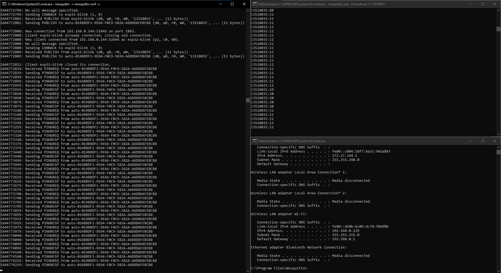

# Micropython ESP32 Blink

## Setup

Input this lines to the REPL to :

```py
import upip
upip.install('micropython-umqtt.simple')
upip.install('micropython-umqtt.robust')
```

Setup Mosquitto MQTT broker on your local machine. Certain parameters should be added to the config:

```
allow_anonymous true
listener 1883 0.0.0.0
max_keepalive 0
```

## Screenshot


